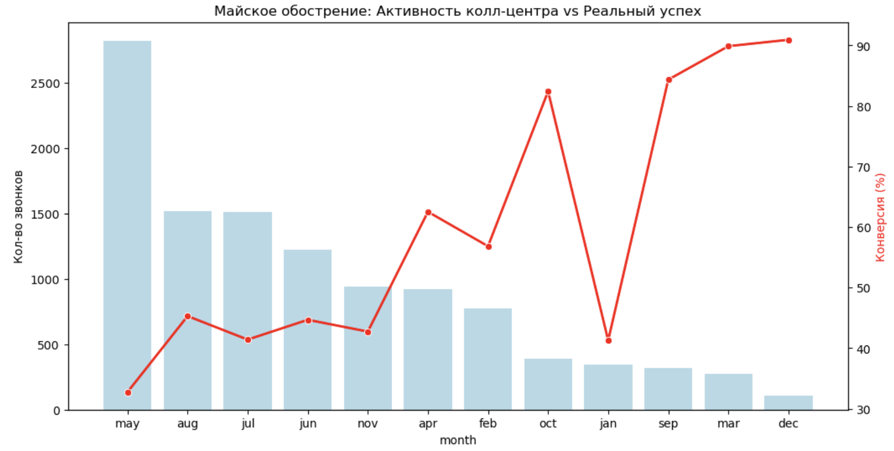

# Анализ маркетинговой кампании банка и прогнозирование депозитов

##  Цель проекта
Оптимизация работы колл-центра банка: выявление факторов, влияющих на открытие депозита, и построение модели предсказания отклика клиентов.

##  Основные этапы анализа (EDA)
В ходе исследования данных (11,000+ записей) были обнаружены ключевые инсайты:

1. **"Майское обострение" (Аномалия):** 
   - Май — самый загруженный месяц (2824 звонка), но с **самой низкой конверсией (32.7%)**.
   - Причина: обзвон "холодной" базы с низким средним балансом.
2. **Лояльность vs Новые клиенты:**
   - Конверсия "старых" клиентов (**67.1%**) почти в 2 раза выше, чем новых.
   - Медианный баланс лояльных клиентов на **31% выше**.
3. **Ключевые факторы:** 
   - Деньги решают всё: `balance` — самый важный признак.
   - На втором месте — `age` и `day` (эффект "дней зарплаты").

##  Моделирование
Была построена модель **Random Forest**, оптимизированная через `GridSearchCV`.

### Метрики модели:
- **Accuracy:** 0.74
- **Precision (успех):** 0.79 — *Это значит, что 4 из 5 предсказанных звонков будут успешными.*
- **Recall:** Оптимизирован до **0.80** путем настройки порога вероятности (Threshold = 0.35).

**Результат оптимизации:** Мы снизили риск упущенной выгоды, "спасая" клиентов, которых стандартная модель помечала как безнадежных.

##  Технологический стек
- **Python** (Pandas, Scikit-learn, Seaborn, Matplotlib)
- **SQL / DuckDB** (для первичной агрегации данных)
- **Joblib** (для сериализации модели)

##  Бизнес-рекомендации
1. Исключить массовый обзвон в мае для сегмента с балансом ниже 400.
2. Использовать модель для приоритизации звонков: в первую очередь обзванивать клиентов с вероятностью > 0.7.
3. Учесть "фактор дня": планировать пик активности на числа месяца, выявленные моделью как наиболее конверсионные.
